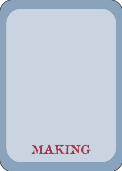
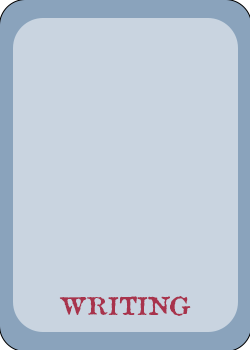
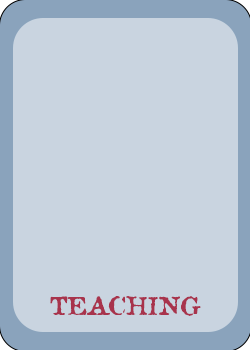
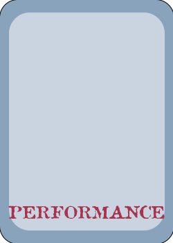

<link rel="stylesheet" href="{{ "/assets/custom.css" | relative_url }}">

 
  
Short banner text.

  
  
  
  

# Portfolio

Some text goes here!

## Head 2
More text

### Head 3
More
#### Head 4
Still more
##### Head 5
A little more
###### Head 6
Some text with [a link to the making](making/) page.

here I embed [another link](https://www.w3schools.com/) to someplace else.
